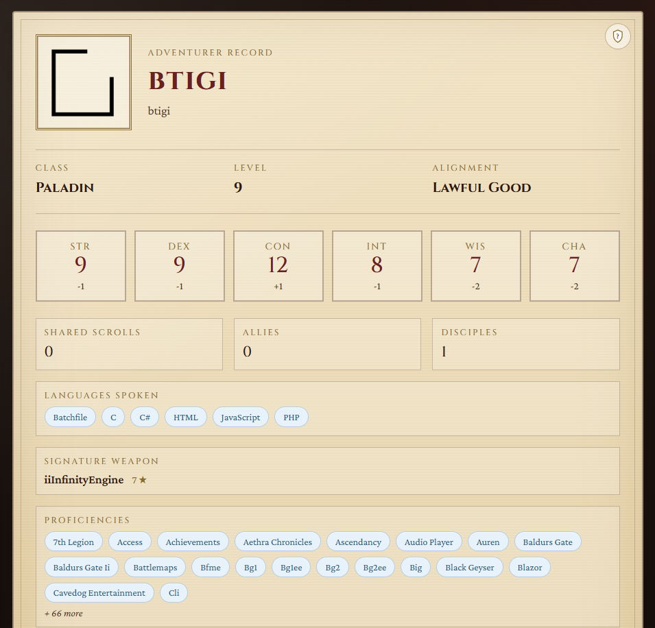

# GitDD

GitDD is a client-side Blazor WebAssembly app inspired by [gitfut](https://github.com/younesfdj/gitfut). Visit `/{username}` and your public GitHub profile is distilled into a basic D&D 'character sheet', six ability scores, class, level, alignment, and more.



## Notes

Info is read from github using an unauthenticated REST API, so the app is limited to 60 requests/hour per IP.
Each character sheet fetch makes 3 API calls.
Results are cached in browser local storage for 30 minutes.

The cache can be overriden by appending `?refresh=1` to the URL.

## How adventuring works

| Stat    | Ability      | Calculated from |
| ---     | ---          | ---             |
| **STR** | Strength     | Total stars earned across owned (non-fork) repos |
| **DEX** | Dexterity    | Commits and pushes from public events in the last 90 days |
| **CON** | Constitution | Account age (years × 2) plus public repo count |
| **INT** | Intelligence | Number of distinct languages used across owned repos |
| **WIS** | Wisdom       | Pull requests, reviews, and half of issue events (last 90 days) |
| **CHA** | Charisma     | Follower count |

### Adventurer details

| Label                | GitHub source                |
| ---                  | ---                          |
| **Public Gists**     | `public_gists`               |
| **Allies**           | `following`                  |
| **Disciples**        | Sum of `forks_count` on owned repos |
| **Languages Spoken** | Distinct repo languages      |
| **Signature Weapon** | Top owned repo by star count |
| **Proficiencies**    | Distinct repo topics         |

### Derived values

- **Class** — highest ability score (STR→Barbarian, DEX→Rogue, CON→Paladin, INT→Wizard, WIS→Cleric, CHA→Bard; ties break in that order)
- **Level** — overall activity
- **Alignment** — inferred from stat spread


## Run locally

Requires [.NET 10 SDK](https://dotnet.microsoft.com/download) or later.

```bash
cd GitDD
dotnet run
```

## Licence

Git DD is licenced under the MIT license. Full licence details are available in license.md


## Credits
- Gid DD uses the [Cinzel font](https://fonts.google.com/specimen/Cinzel/license?preview.script=Latn) by Natanael Gama, licensed under the SIL Open Font License, 1.1, hosted by Google Fonts.
- Gid DD uses the [Crimson Pro](https://fonts.google.com/specimen/Crimson+Pro/license?preview.script=Latn) by Jacques Le Bailly, licensed under the SIL Open Font License, 1.1, hosted by Google Fonts.